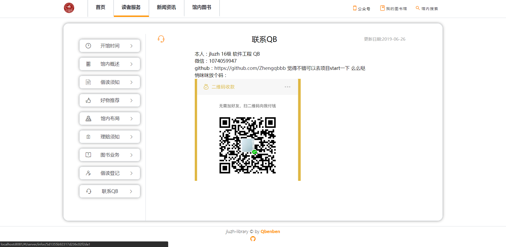
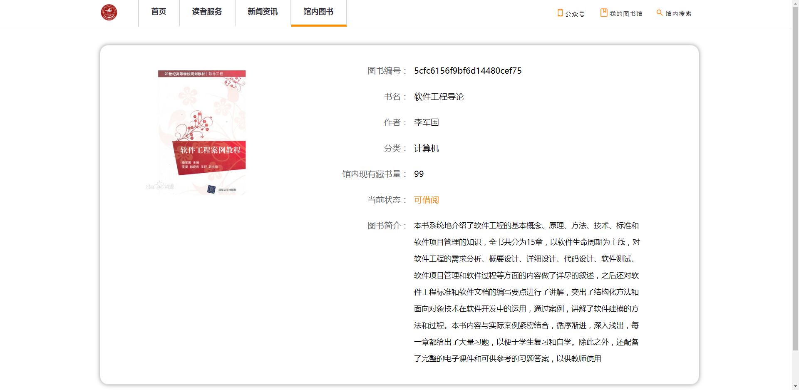
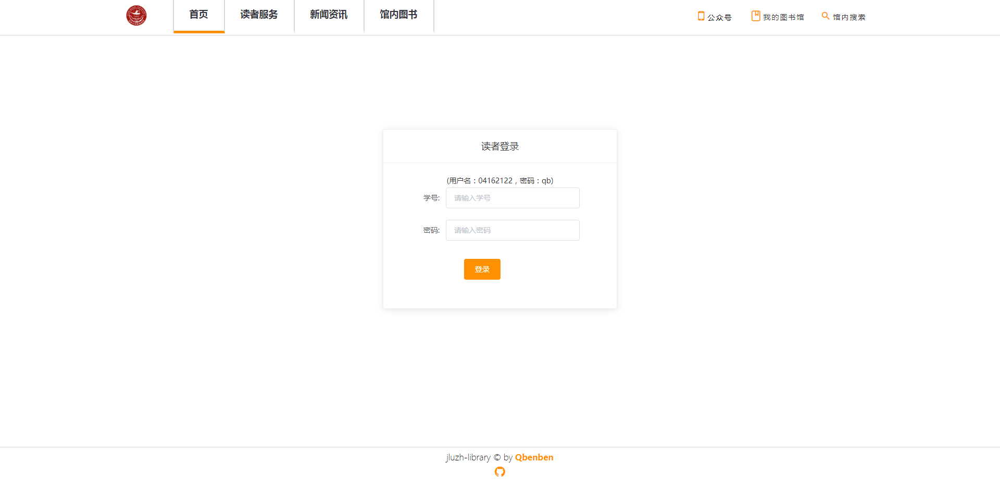
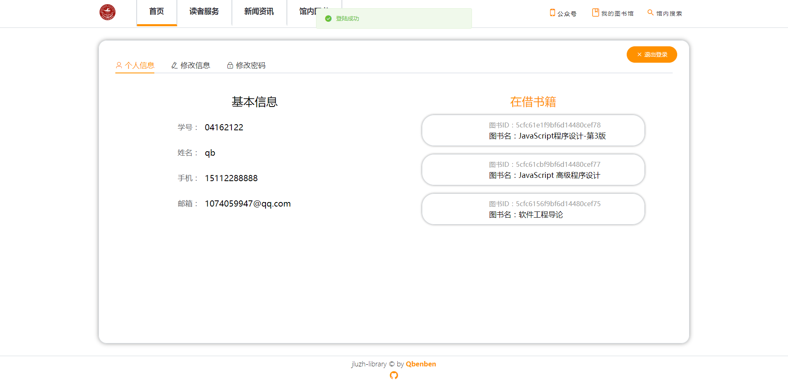
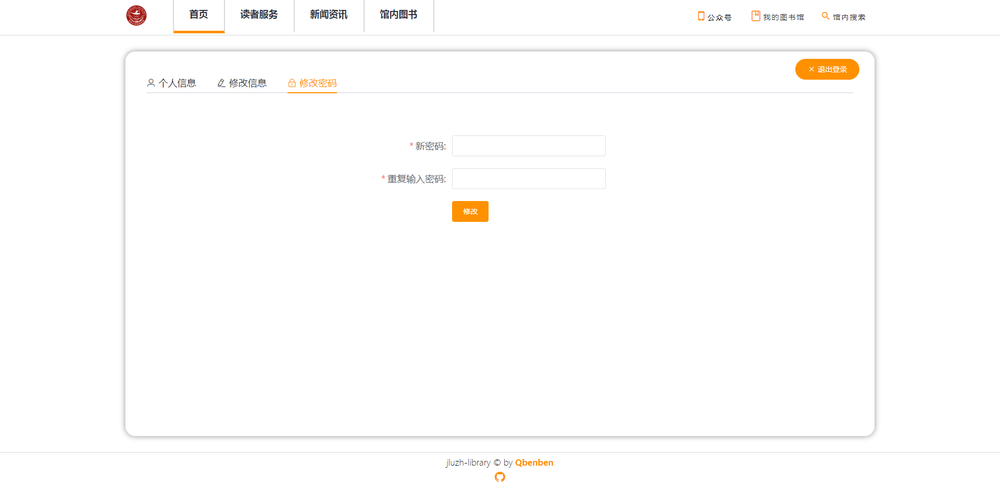
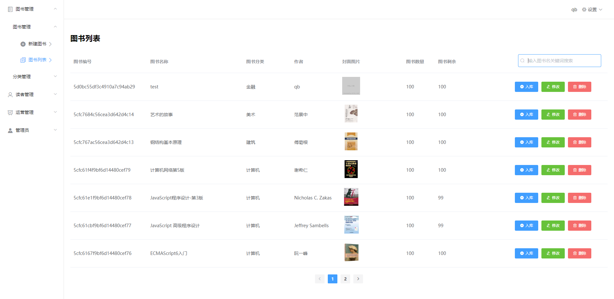
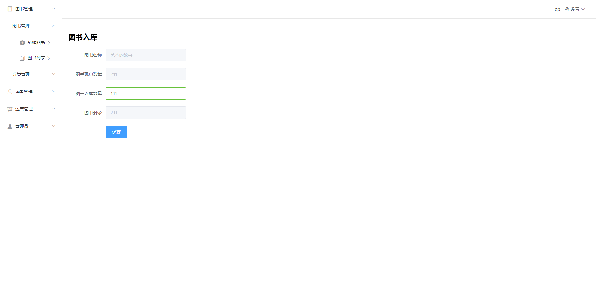
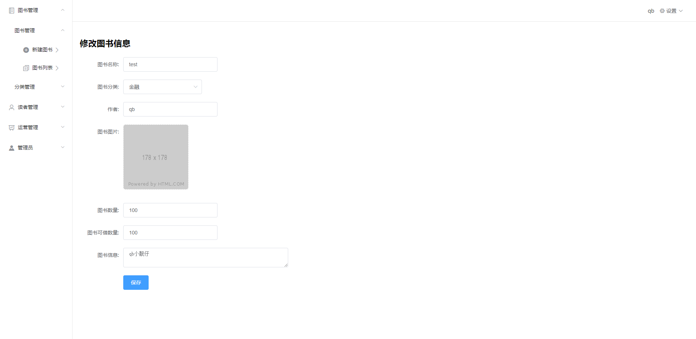

Jluzh-library
个人全栈课程设计——图书馆官网管理系统
===

* 很痛苦之前上传到git上面管理，没有贡献值！！！因为邮箱问题很痛苦2019：6-9~6-18
## 说明
* admin 后台界面
* server 整个项目的服务端
* web 客户端界面

## 后台前端
*  技术栈:<code>Vue.js</code>
* Vue.cli Vue脚手架，Vue的构建工具
* router 路由管理器，对路由进行管理
* ElementUI 组件进行开发
* axios 进行异步操作管理
* localStorage 作登录状态管理
* vue2-editor 作富文本编辑器
* dayjs 对时间戳进行格式化

##  服务端
*  技术栈:<code>node.js,</code><code>MongoDB</code>
* Express框架 处理数据接口
* mongoose 建立数据模型
* Express static中间件对静态文件托管
* cors 作跨域访问
* bcrypt 用于对密码进行加密处理
* http-assert 用于错误处理
* inflection 用于对传入路径字符串进行类名的转换
* multer Express中间件实现前端传入文件进行保存
* JSON Web Token 对登录状态码的生成以及验证

## 前台前端
*  技术栈:<code>Vue.js</code>
* Vue.cli Vue脚手架，Vue的构建工具
* SCSS 工具类样式对css进行开发
* router 路由管理器，对路由进行管理
* CategoryCard BookCard 自封装分类与图书卡片组件
* Vue-Awesome-Swiper 组件用于首页轮播图,书籍推荐界面,分类卡片应用 Github:[https://github.com/surmon-china/vue-awesome-swiper]
* axios 进行异步请求操作
* ElementUI 组件应用在label,消息提示,登录卡片,表格
* dayjs 对时间戳进行格式化

---
## 图片预览：
## 前台
* 前台首页

* 前台读者服务

* 前台新闻公告
 

* 前台馆内图书
 

* 前台我的图书馆
 

* 前台馆内搜索

## 后台
* 图书分类管理
 

* 图书管理
 

---
学习途径：B站UP主源码：<a target="_blank" href="https://github.com/wxs77577/node-vue-moba">全栈之巅</a> 
