Jluzh-library  
个人全栈课程设计——图书馆官网管理系统
===
# 目前网站还在备案中 2019-8-1 ——— 前台：https://49.234.194.87 后台：https://49.234.194.87/admin IP端口访问需要点击高级，继续访问（无毒）
* 很痛苦之前上传到git上面管理，没有贡献值！！！因为邮箱问题很痛苦2019：6-9~6-18
* 请先安装 nodejs 10+ ，mongodb server，nodemon，vue cli 3
## 说明
* admin 后台界面
* server 整个项目的服务端
* web 客户端界面

## 后台前端
*  技术栈:<code>Vue.js</code>
* Vue.cli Vue脚手架，Vue的构建工具
* router 路由管理器，对路由进行管理
* ElementUI 组件进行开发
* axios 进行异步操作管理
* vue2-editor 作富文本编辑器
* dayjs 对时间戳进行格式化

##  服务端
*  技术栈:<code>node.js,</code><code>MongoDB</code>
* Express框架 处理数据接口
* mongoose 建立数据模型
* Express static中间件对静态文件托管
* cors 作跨域访问
* bcrypt 用于对密码进行加密处理
* http-assert 用于错误处理
* inflection 用于对传入路径字符串进行类名的转换
* multer Express中间件实现前端传入文件进行保存
* JSON Web Token 对登录状态码的生成以及验证

## 前台前端
*  技术栈:<code>Vue.js</code>
* Vue.cli Vue脚手架，Vue的构建工具
* SCSS 工具类样式对css进行开发
* router 路由管理器，对路由进行管理
* CategoryCard BookCard 自封装分类与图书卡片组件
* Vue-Awesome-Swiper 组件用于首页轮播图,书籍推荐界面,分类卡片应用 Github:[https://github.com/surmon-china/vue-awesome-swiper]
* axios 进行异步请求操作
* ElementUI 组件应用在label,消息提示,登录卡片,表格
* dayjs 对时间戳进行格式化

 图片预览：(PS：可选择放大观看 CTRL+鼠标滑轮向前)
===
# 前台

## 前台-首页
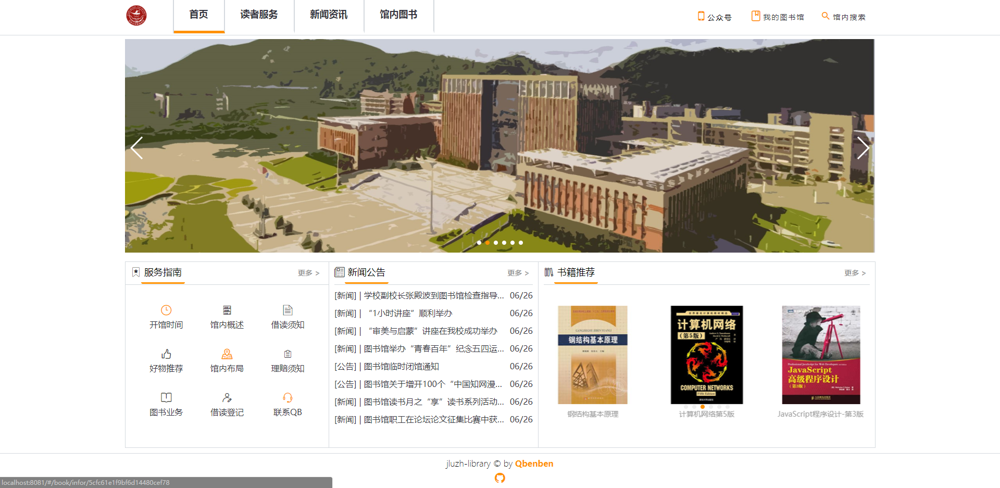

## 前台-读者服务

## 前台-新闻公告

|                                                                                     |                                           |
| --------------------------------------------------------------------------------------- | ------------------------------------------- |
| 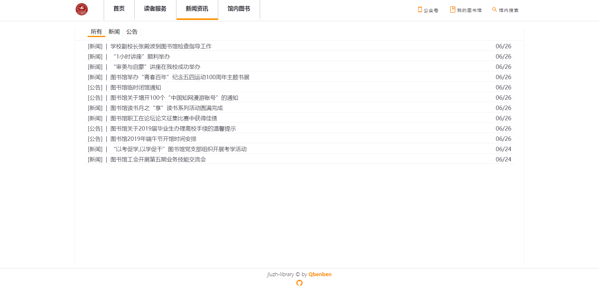 新闻公告列表                                                     |  新闻公告详情       |

## 前台-馆内图书

|                                                                                     |                                           |
| --------------------------------------------------------------------------------------- | ------------------------------------------- |
| 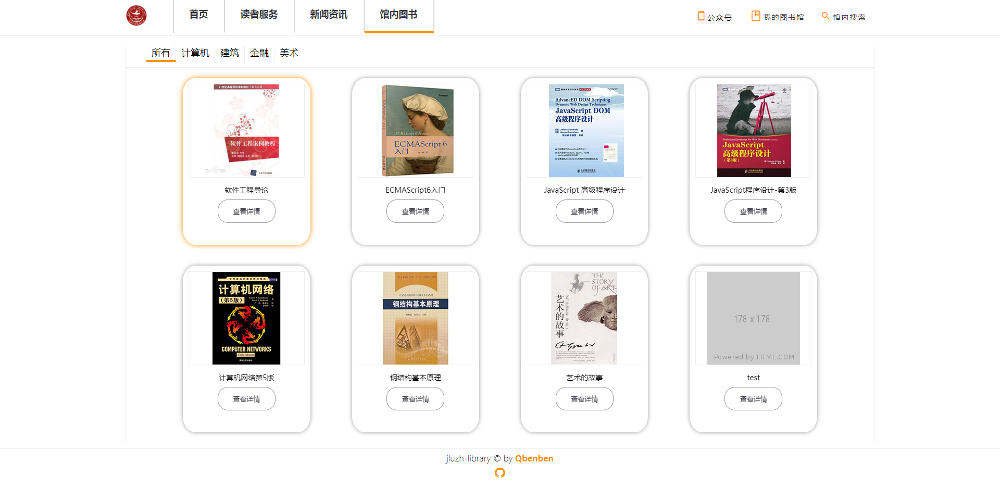 图书列表                                                     |  图书详情       |

## 前台-我的图书馆

|                                                                                       |                                            |
| --------------------------------------------------------------------------------------- | ------------------------------------------- |
|  读者登陆页                                                     |  读者详情页       |
| 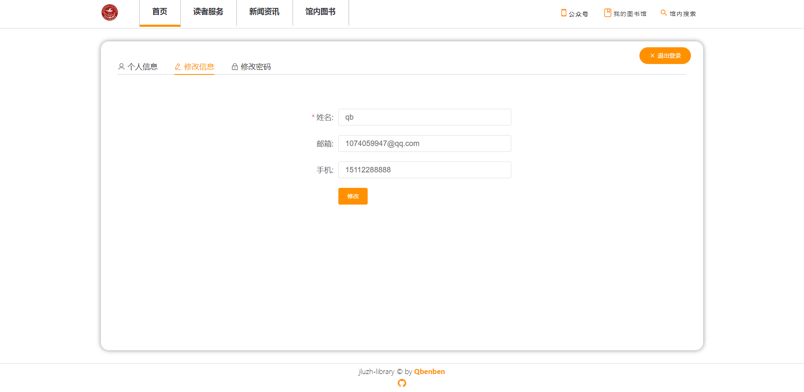 读者修改资料                                           |  读者修改密码 |
| 

## 前台-馆内搜索
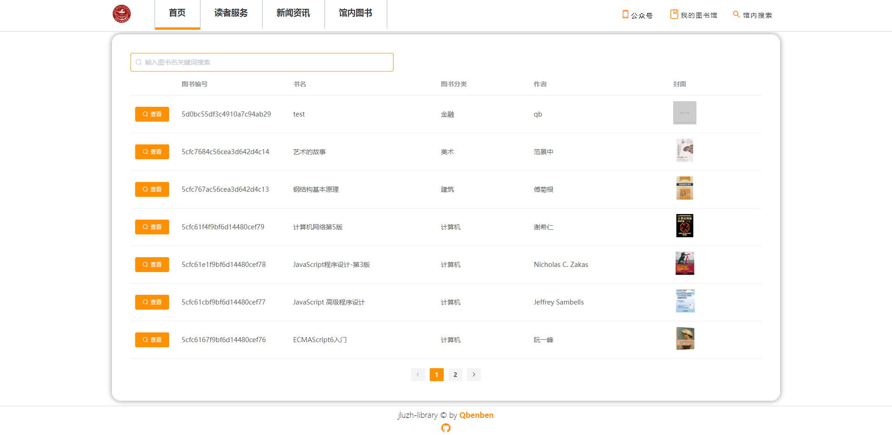

# 后台
## 后台-图书分类管理

|                                                                                       |                                            |
| --------------------------------------------------------------------------------------- | ------------------------------------------- |
| 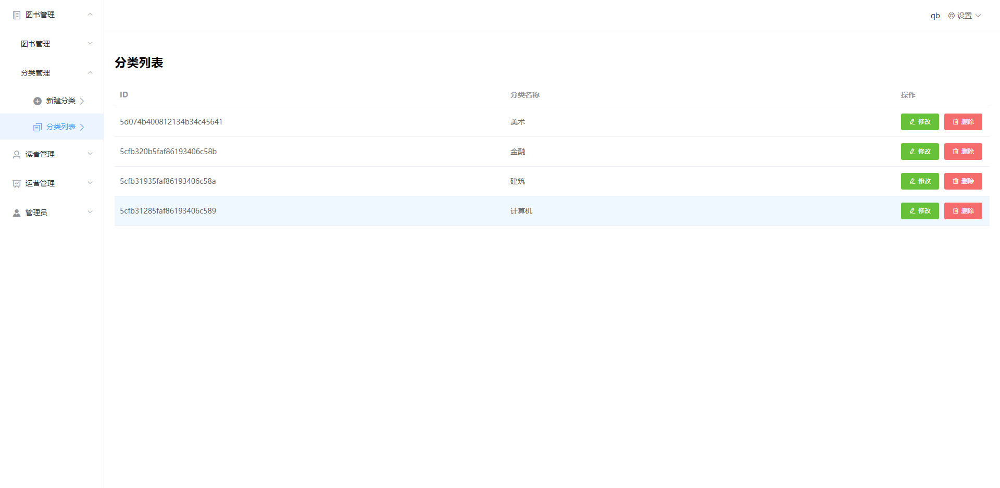 图书分类列表                                                     | 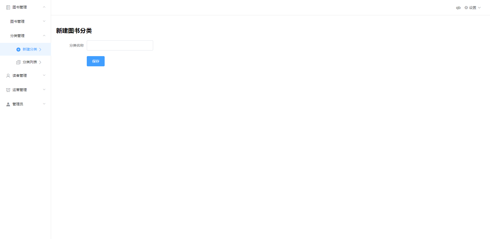 图书分类添加       |
|

## 后台-图书管理

|                                                                                       |                                            |
| --------------------------------------------------------------------------------------- | ------------------------------------------- |
|  图书列表                                                     |  图书入库       |
| 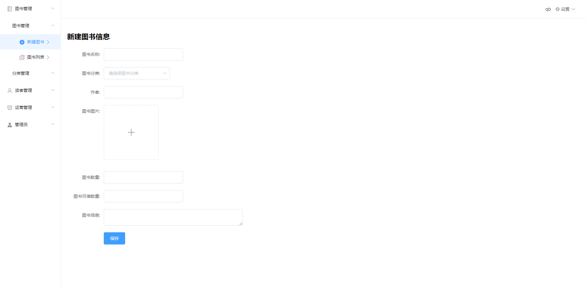 图书新增                                           |  图书修改 |

## 后台-读者管理

|                                                                                       |                                            |
| --------------------------------------------------------------------------------------- | ------------------------------------------- |
|  读者列表                                                     | 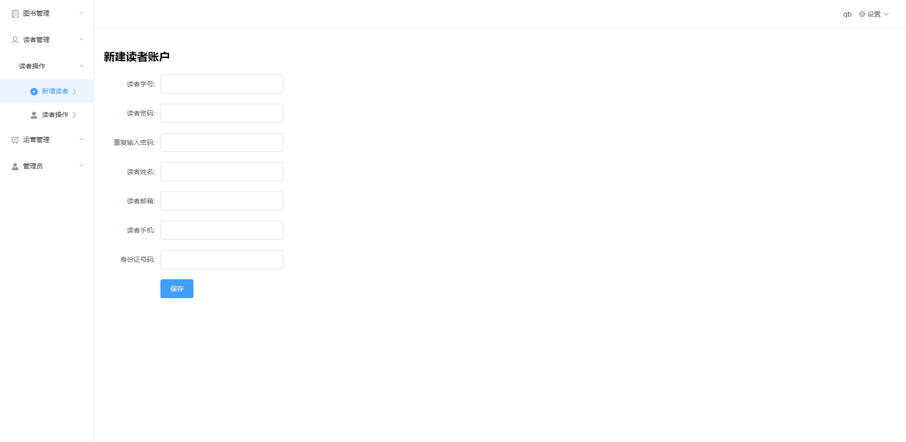 读者添加       |
|  读者借书                                           |  读者还书 |

## 后台-广告管理

|                                                                                       |                                            |
| --------------------------------------------------------------------------------------- | ------------------------------------------- |
|  广告列表                                                     |  广告添加       |
|  修改广告                                           | 

## 后台-文章分类管理

|                                                                                       |                                            |
| --------------------------------------------------------------------------------------- | ------------------------------------------- |
|  文章分类列表                                                     |  文章分类添加       |
|

## 后台-新闻管理

|                                                                                       |                                            |
| --------------------------------------------------------------------------------------- | ------------------------------------------- |
|  文章列表                                                     | 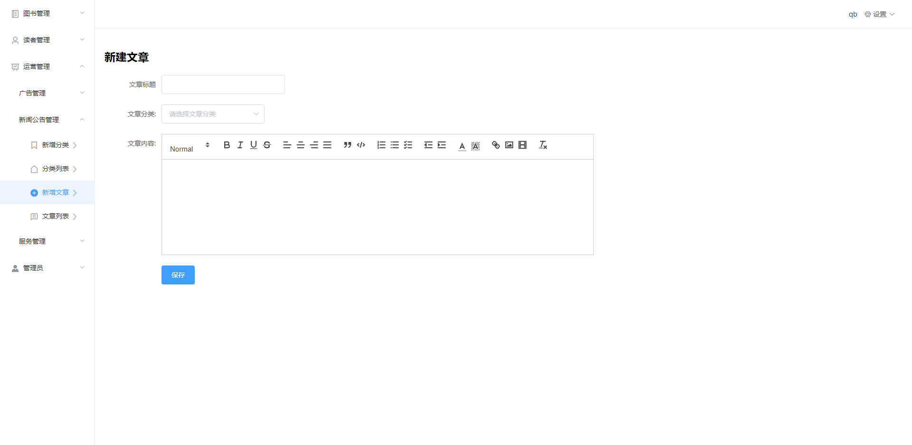 文章添加       |
|  修改文章                                          | 

## 后台-服务管理

|                                                                                       |                                            |
| --------------------------------------------------------------------------------------- | ------------------------------------------- |
|  服务列表                                                     | 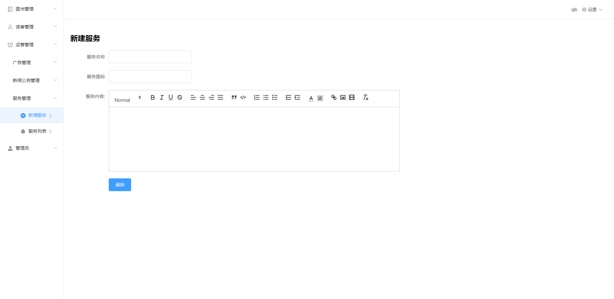 服务添加       |
|

## 后台-管理员管理

|                                                                                       |                                            |
| --------------------------------------------------------------------------------------- | ------------------------------------------- |
| 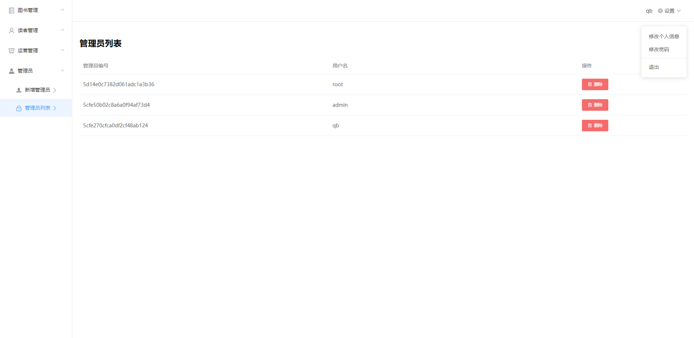 管理员列表                                                     | 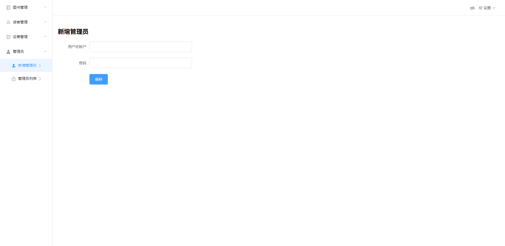 管理员添加       |
|

##  发布和部署：https://library.qbenben.com 
域名目前还在备案中： http://library.qbenben.com 使用ssl证书到443端口绕了下备案
* 生产环境编译  [done]
* 购买服务器、购买域名 [done]
* 域名解析 [done]
* Nginx 安装和配置 [done]
* MongoDB数据库安装和配置 [done]
* 更新服务器MongoDB版本号 [done]
* Node.js安装、配置淘宝镜像 [done]
* 拉取代码，安装pm2并启动项目 [done]
* 配置 Nginx 的反向代理 [done]

--- 
学习途径：B站UP主源码：<a target="_blank" href="https://github.com/wxs77577/node-vue-moba">全栈之巅</a> 
